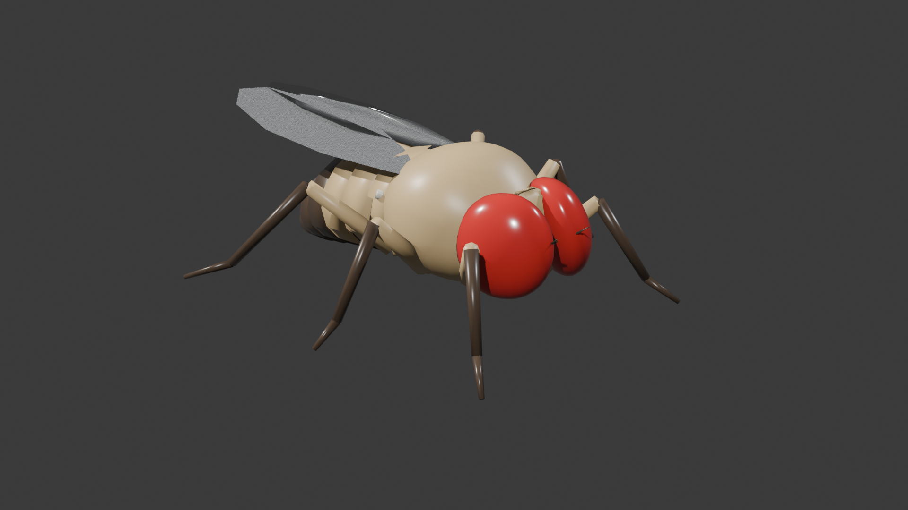

# Drosophila melanogaster 3D Connectome Simulation

An anatomically accurate 3D fruit fly (*Drosophila melanogaster*) model and real-time autonomous simulation driven by the **Google Research / FlyWire Adult Whole-Brain Connectome** (*Nature* 2024).



---

## Deliverables & Assets

| Asset / File | Format | Description |
| :--- | :--- | :--- |
| `drosophila_melanogaster.blend` | Blender 5.2+ | Master Blender file with PBR materials, 3-point studio lighting, and hierarchy. |
| `drosophila_melanogaster.glb` | glTF 2.0 Binary | Real-time simulation asset (~94 KB, 1,380 polygons) preserving full FK joint hierarchy. |
| `drosophila_brain.glb` | glTF 2.0 Binary | 3D mesh of fruit fly brain neuropils (Central Complex, Mushroom Bodies, Antennal & Optic Lobes). |
| `google_flywire_connectome.json` | JSON | Connectome circuit dataset (synaptic weights, neurotransmitters, descending pathways). |
| `env.glb` | glTF 2.0 Binary | Arena ground plane environment. |
| `index.html` / `simulation.js` | WebGL / Three.js | Real-time autonomous simulation with live E-PG compass dial & brain HUD. |
| `connectome.js` | JavaScript | Connectome circuit engine running biological activation dynamics. |
| `generate_fly.py` | Python (Blender) | Procedural generation script for the fruit fly model in Blender. |
| `build_brain.py` | Python (Blender) | Procedural generation script for the 3D brain neuropils in Blender. |
| `run_simulation.py` | Python | Local HTTP server launcher with automatic browser opening. |

---

## Anatomical Improvements

1. **Head & Sensory Complex**:
   - **Head Capsule**: Integrated central face (frons) and vertex connecting cleanly to the neck (cervix).
   - **Compound Eyes**: Large, almond/kidney-shaped ruby red eyes that wrap around the lateral and anterior sides of the head.
   - **Antennae & Arista**: Aristate antennae nestled in the facial depression with feathery branching bristles pointing forward.
   - **Proboscis**: Hinged ventral labellum/haustellum mouthparts.

2. **Thorax**:
   - **Mesoscutum**: Humped dorsal profile with realistic anterior neck taper.
   - **Scutellum Shield**: Distinct posterior triangular shield overhanging the abdominal connection.

3. **Segmented Abdomen**:
   - Built as **6 discrete overlapping tergite plates (T1–T6)**.
   - Displays authentic Oregon-R wild-type coloration: alternating yellow-tan anterior tergites with dark brown/black posterior bands, ending in a solid dark male posterior tip.

4. **Natural Perched Stance & Long Articulated Legs**:
   - Fly body sits at a natural perched height ($Z = 0.52\text{ mm}$).
   - **6 Sprawling Legs**:
     - **Front Legs**: Reach forward and outward to balance the head.
     - **Mid Legs**: Splay laterally with high arched knees for tripod stability.
     - **Hind Legs**: Longest limbs, extending backward and outward.
   - All 6 feet are planted firmly on the ground plane ($Z = 0.0\text{ mm}$).

---

## Leg Animation & Forward Kinematics (FK)

Every leg segment has its **origin placed exactly at its proximal joint pivot** in the kinematic chain:

$$\text{Thorax} \longrightarrow \text{Coxa} \longrightarrow \text{Femur} \longrightarrow \text{Tibia} \longrightarrow \text{Tarsus}$$

* **Coxa**: Origin at thorax socket. Rotates along local **Z** (swing forward/back) and **X** (elevation).
* **Femur**: Origin at hip joint. Rotates along local **X** (pitch leg up/down).
* **Tibia**: Origin at knee joint. Rotates along local **X** (knee flexion/extension).
* **Tarsus**: Origin at ankle joint. Rotates along local **X** (foot compliance with terrain).

Because child segments inherit parent transformations directly, you can articulate natural walking gaits either manually in Blender or via Python motor neuron scripts.

---

## Running the Simulation Locally

To start the local web simulation:

```bash
python run_simulation.py
```

Then navigate to `http://localhost:8000/index.html` in your browser.

### Spectator Navigation
* **Left Click + Drag**: Orbit 360° around the fruit fly.
* **Mouse Wheel / Scroll**: Zoom in for macro detail or zoom out for full arena view.
* **Right Click + Drag**: Pan camera position.
* **HUD Controls**: Trigger specific behaviors (Forage / Walk, Groom Face, Groom Wings, Wing Stretch) and toggle **X-Ray Brain View**.

---

## Biological Connectome Circuits

Derived from Google Research & FlyWire adult Drosophila connectome data (*Nature* 2024):
* **Central Complex (EB / PB / FB)**: Ring attractor computing internal heading via E-PG compass neurons.
* **DNb01**: Descending neuron controlling forward walking velocity.
* **DNa01 / DNa02**: Descending neurons generating angular turning / saccades.
* **DNp09 / aDN1**: Antennal and head-grooming motor command circuits.
* **MDN**: Moonwalker descending neuron for backward / evasive stepping.

